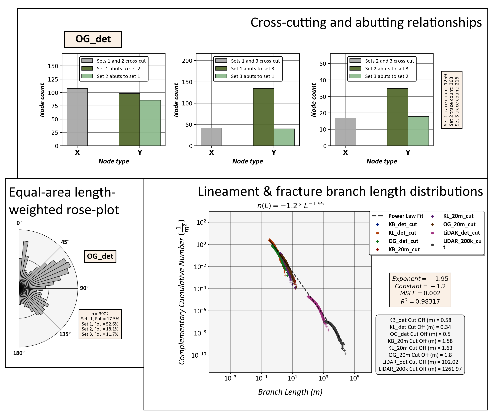

**Fracture Analysis 2D**
================================================

This QGIS plugin can be used to extract lineament & fracture size, abundance and topological parameters
from two-dimensional GIS polylines along with their topological branches and nodes.
The results will be given as graphical plots.

The plugin is **experimental** **and a work-in-progress** and installation requires the **manual installation** of a few external python libraries. **Installation at this stage is not recommended though it is possible.**

This plugin uses four types of vector data as inputs:
*traces* (Polylines), *branches* (Polylines), *nodes* (Points) and *areas* (Polygons).

*Traces* can be manually or automatically digitized GIS polyline features from e.g.
Light Detection And Ranging (LiDAR) digital elevation models (DEMs)
or from drone orthophotography of bedrock outcrop surfaces.
*Branches* and *nodes* are derived from `NetworkGT`_.
*Areas* are the interpretation boundaries of the traces and branches.

	*Example plots from the plugin.*

NetworkGT
-------------

This plugin has been built to **only** work with data extracted using another QGIS-plugin, NetworkGT `(Homepage) <https://github.com/BjornNyberg/NetworkGT>`_ (Also see: `Nyberg et al., 2018`__):

	*The NetworkGT (Network Geometry and Topology) Toolbox is a set of tools designed for
	the geometric and topological analysis of fracture networks.*

If the input data (*traces*) you have can be processed in NetworkGT into *branches* and *nodes*
it is suitable for this plugin. NetworkGT is available for both QGIS and ArcGIS
and branch and node data from both *should* be valid inputs into this plugin (*as of 15.2.2020*).

.. _NGT: https://github.com/BjornNyberg/NetworkGT
.. _Nyberg2018: https://pubs.geoscienceworld.org/gsa/geosphere/article/531129/networkgt-a-gis-tool-for-geometric-and-topological
__ Nyberg2018_

Help Documentation
------------------
**Help Documentation Download** `Here <zip_build/help.zip>`_ *(Click download inside)*

Download the .zip-file and unzip the file to a folder of your choosing.

Then open index.html in the folder. It should open the Help Documentation in your native browser.

Plugin Download
---------------

**Plugin Download** `Here as a .zip file <zip_build/fracture_analysis_2d.zip>`_ *(Click download inside)*

Plugin Installation and Updating
---------------------------------

Download the `Help Documentation`_ and follow the instructions there.

Sample Data
-----------

Sample data from an island in SE-Finland is included. Contains an orthomosaic of an island outcrop (*.tif*), manually digitized traces (*Shapefile*), branches (*Shapefile*) and nodes (*Shapefile*) extracted from `NetworkGT`_ and the interpretation boundary polygon (*Shapefile*).

