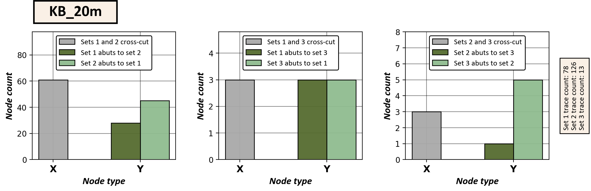
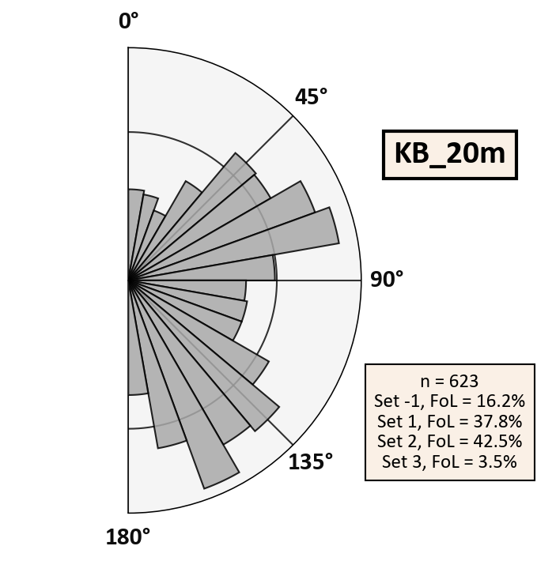
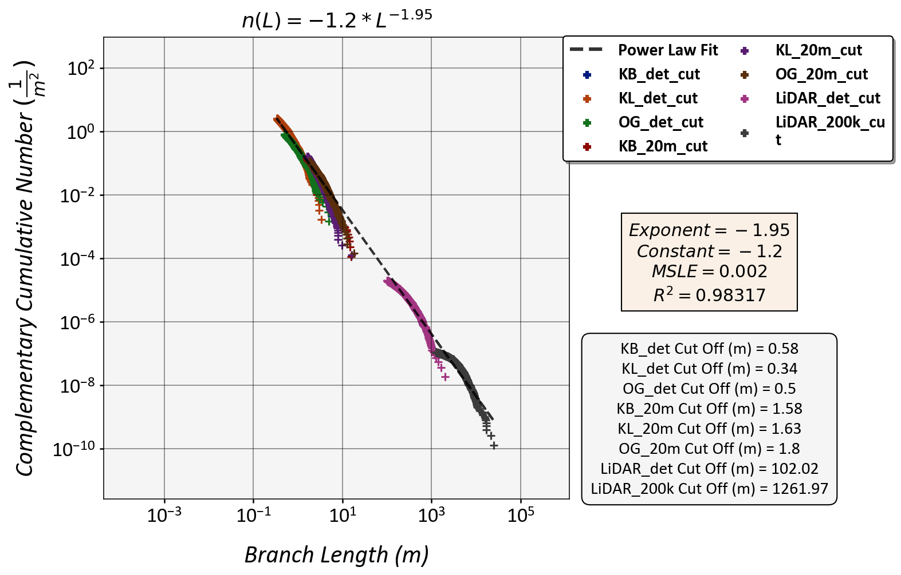

.. Fracture Analysis 2D documentation master file, created by
   sphinx-quickstart on Sat Feb 15 14:33:49 2020.
   You can adapt this file completely to your liking, but it should at least
   contain the root `toctree` directive.

**Fracture Analysis 2D**
================================================

Description
-----------
This QGIS plugin can be used to extract lineament & fracture size, abundance and topological parameters 
from two-dimensional GIS polylines along with their topological branches and nodes. 
The results will be given as graphical plots.

The plugin is **experimental** and installation requires the **manual installation** of a few external python libraries. 
Installation requirements and guide below.

This plugin uses three types of vector data as inputs: *traces*, *branches* and *nodes*. 
Traces can be manually or automatically digitized GIS polyline features from e.g. 
Light Detection And Ranging (LiDAR) digital elevation models (DEMs)
or from drone orthophotography of bedrock outcrop surfaces. 

Example plots
-------------

*Cross-cutting and abutting relationships between sets.*

*Equal-area length-weighted rose plot of fracture branches.*

*Length distributions of lineament & fracture branches along with numerically fitted power-law trendline.*

   
.. _installation:

**Installation**
==================

Requirements
------------

Plugin has **only** been tested on Windows. No functionality on other platforms guaranteed.

External Python module installation
-----------------------------------
First we will install Fiona. Due to QGIS bugs, this cannot be done automatically through pip instead we need to download the module ourselves.
Go to: https://www.lfd.uci.edu/~gohlke/pythonlibs/#fiona and download either:

* Fiona-1.8.13-cp37-cp37m-win_amd64.whl (64x bit OS)
* Fiona-1.8.13-cp37-cp37m-win32.whl (32x bit OS)

Next up: Start up OSGeo4W Shell as **administrator** (**Important!**). This should pop up by searching in Windows start up menu 
(Press windows key on your keyboard and type OSGeo4W Shell). To install the just downloaded file, 
the OSGeo4W Shell must be in the same directory as the file. Go to where your Fiona-...-.whl file is downloaded and copy the url (Example URL: ).
Next up, we'll change the OSGeo4W Shell location by typing::
	
	cd /D *paste your url here without the asterisks*

Good. The Fiona installation depends on which version of Fiona you downloaded. E.g. if you have the 64x bit version, use this::

	python -m pip install Fiona-1.8.13-cp37-cp37m-win_amd64.whl
	
Else if you have the 32x bit version, use this::

	python -m pip install Fiona-1.8.13-cp37-cp37m-win32.whl

Hopefully the installation succeeds without issues. Next up we will install *geopandas*. Type in the OSGeo4W Shell::

	python -m pip install geopandas
	
Next, we will install *python-ternary*. Type in the OSGeo4W Shell::
	
	python -m pip install python-ternary
	
Next, we will install *sklearn*. Type in the OSGeo4W Shell::
	
	python -m pip install sklearn

Next, we will install *seaborn*. Type in the OSGeo4W Shell::
	
	python -m pip install seaborn

**And we are done!**

Plugin installation from .zip file
-----------------------------------
After installing Python modules, you may install the plugin in QGIS.
Go to *Plugins* -> *Manage and Install Plugins...* and choose *Install from ZIP*. Find the .zip file with the plugin and install.

**Help**
==================

**Dependencies and References**
===============================

References
----------

Both branches and nodes are derived from :ref:`ngt`. 
For their definition along with the definition of the plots and the plotted parameters, 
I refer you to multiple sources. Sources are in order of importance.

* `Nyberg et al., 2018 <https://pubs.geoscienceworld.org/gsa/geosphere/article/531129/networkgt-a-gis-tool-for-geometric-and-topological>`_

	* *NetworkGT Plugin introduction and guide.*
* `Sanderson and Nixon, 2015 <https://www.sciencedirect.com/science/article/pii/S0191814115000152>`_

	* *Trace and branch size, abundance and topological parameter definitions.*
* My Master's Thesis, Ovaskainen, 2020

	* *Plots used in my Thesis were done with an older version of the same code used for this plugin.*
* `Sanderson and Peacock, 2020 <https://www.sciencedirect.com/science/article/abs/pii/S001282521930594X>`_

	* *Information about rose plots.*
* `Bonnet et al., 2001 <https://agupubs.onlinelibrary.wiley.com/doi/abs/10.1029/1999RG000074>`_

	* *Length distribution modelling.*
	

.. _ngt:

NetworkGT
-------------

This plugin has been built to **only** work with data extracted using another QGIS-plugin, NetworkGT_ (see: `Nyberg et al., 2018`__):

	*The NetworkGT (Network Geometry and Topology) Toolbox is a set of tools designed for 
	the geometric and topological analysis of fracture networks.*

If the input data (*traces*) you have can be processed in NetworkGT into *branches* and *nodes* 
it is suitable for this plugin. NetworkGT is available for both QGIS and ArcGIS
and branch and node data from both *should* be valid inputs into this plugin (*as of 15.2.2020*).

.. _NetworkGT: https://github.com/BjornNyberg/NetworkGT
.. _Nyberg2018: https://pubs.geoscienceworld.org/gsa/geosphere/article/531129/networkgt-a-gis-tool-for-geometric-and-topological
__ Nyberg2018_

.. _external_python_modules:

External Python modules
-----------------------
This plugin is dependant on external Python libraries (and their subsequent dependancies) that are not installed by default in QGIS. 

* geopandas_
* python-ternary_
* todo

See :ref:`installation` for installation guide.

.. _geopandas: https://geopandas.org/
.. _python-ternary: https://github.com/marcharper/python-ternary

**Doc**
==================

For Developers: Plugin documentation
------------------------------------

Documentation for Python modules has been created using Autodoc. Autodoc has trouble running without setting the matplotlib backend to Qt5Agg. 
If you wish to remake documentation: Check conf.py and replace my 'QT_QPA_PLATFORM_PLUGIN_PATH' with your own path.

.. toctree::
   :maxdepth: 4
   
   fracture_analysis_2d

**Indices and tables**
======================

* :ref:`genindex`
* :ref:`modindex`
* :ref:`search`

